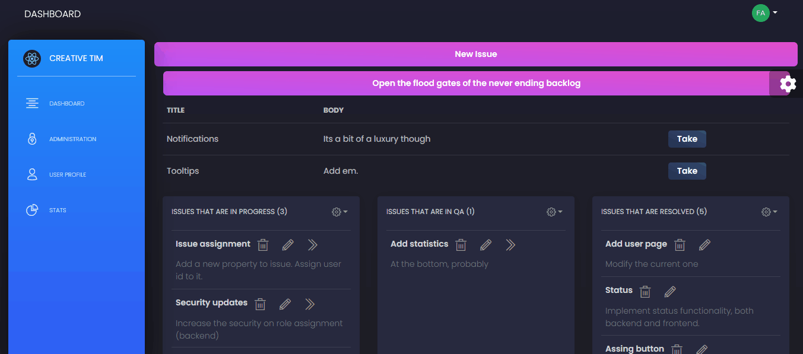
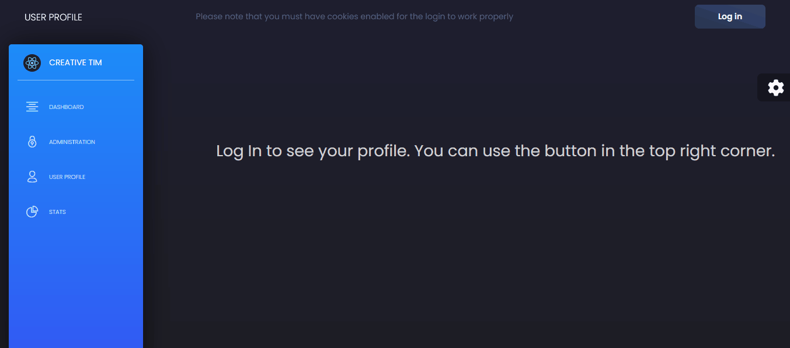

# Gordian
An issue tracker to cut through the madness.

A personal project I developed to both synthesize and showcase the full-stack knowledge I have acquired over the last year and a half. It is an issue tracker with complete CRUD implementation and user authentication, built with Java Springboot on the backend, and Javascript React in the frontend (using a template called Black Dashboard React as a base for the visual style)

## Complete CRUD operations
Create, read, update and delete issues with a responsive, intuitive user interface. Issues have 4 posible states that represent their lifecycles: backlog, in progress, testing (QA) and resolved.

## Authentication and user page
Using the Auth0 library, the app supports user authentication and individual, editable profiles. Please note that in the demonstration below, part of the login process was edited out to protect my credentials.

## Technical details
The backend was coded using Java with Bootspring and maven. It connects to a simple dockerized mongo database, which isn't part of this repo. The frontend uses Black Dashboard React as a template for the CSS; the functionality I coded using javascript and React. Normally I would use typescript instead, but decided to try out plain javascript for variety. Similarly, I decided to follow an MVC design pattern because I'm most familiar with the DTO pattern.
